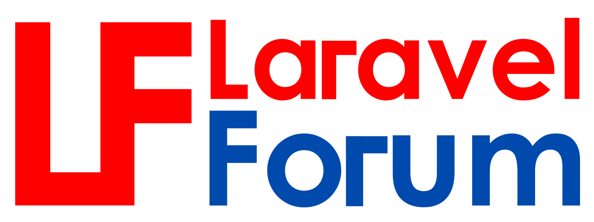

## About Laravel Forum

Laravel Forum is Open-Source Project for Laravel Developer who want to use Forum Project for education purpose.

## Technology Used
- [Laravel 10.x](https://laravel.com)
- [TailwindCSS](https://tailwindcss.com)

Laravel Forum is using powerful technology.

## Learning Laravel

Laravel has the most extensive and thorough [documentation](https://laravel.com/docs) and video tutorial library of all modern web application frameworks, making it a breeze to get started with the framework.

You may also try the [Laravel Bootcamp](https://bootcamp.laravel.com), where you will be guided through building a modern Laravel application from scratch.

If you don't feel like reading, [Laracasts](https://laracasts.com) can help. Laracasts contains over 2000 video tutorials on a range of topics including Laravel, modern PHP, unit testing, and JavaScript. Boost your skills by digging into our comprehensive video library.

## License

- Laravel Forum is **MIT** License.
- The Laravel framework is open-sourced software licensed under the [MIT license](https://opensource.org/licenses/MIT).
